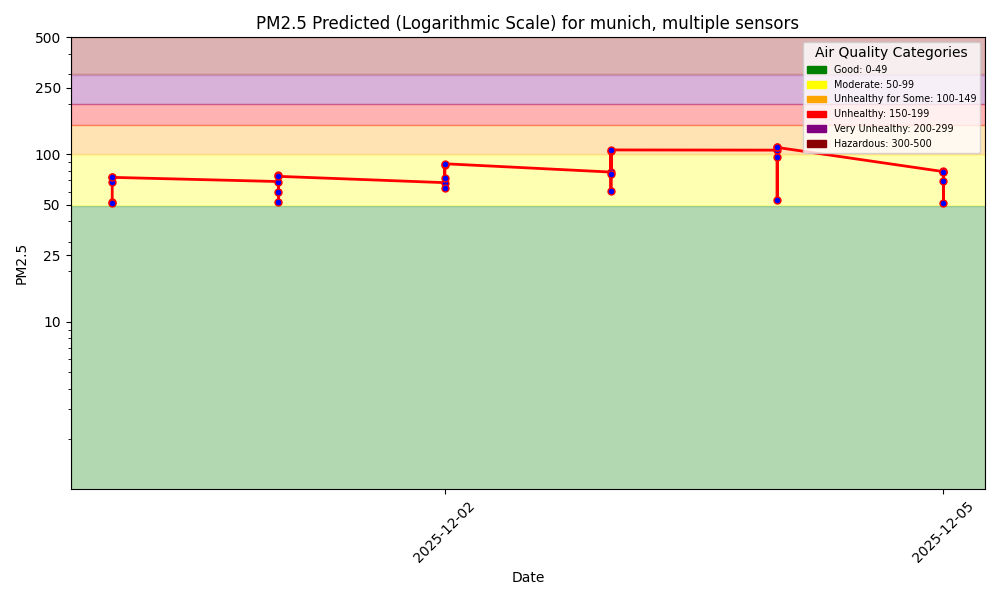
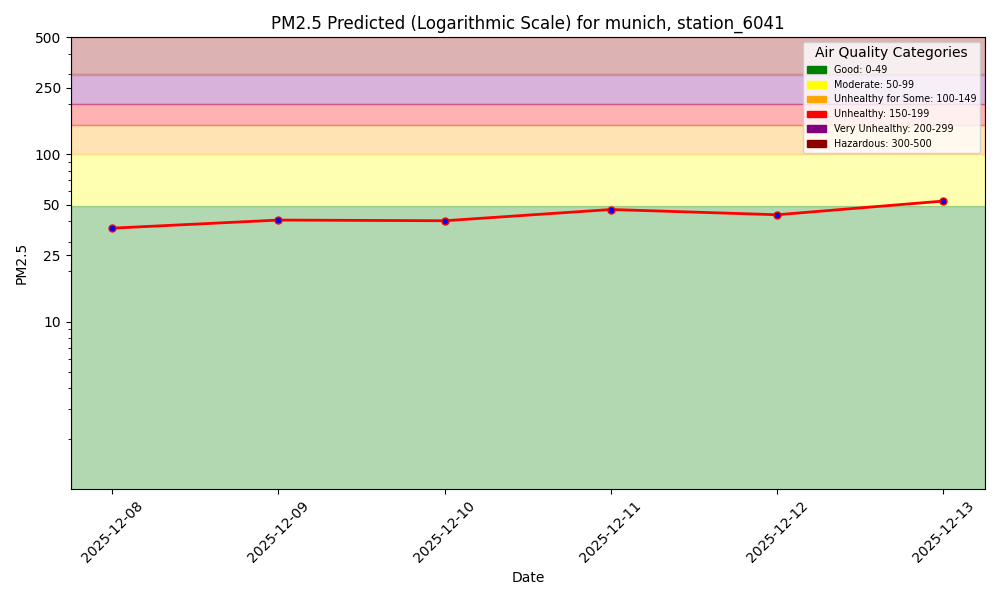
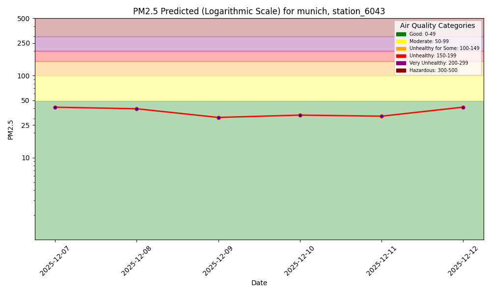
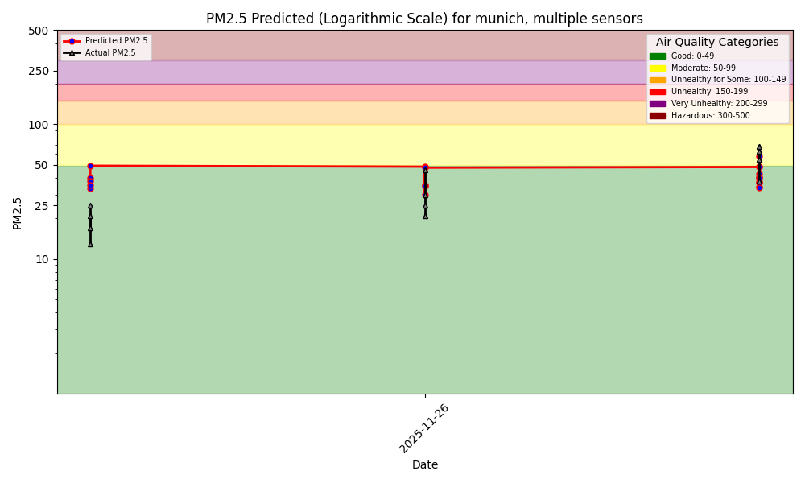
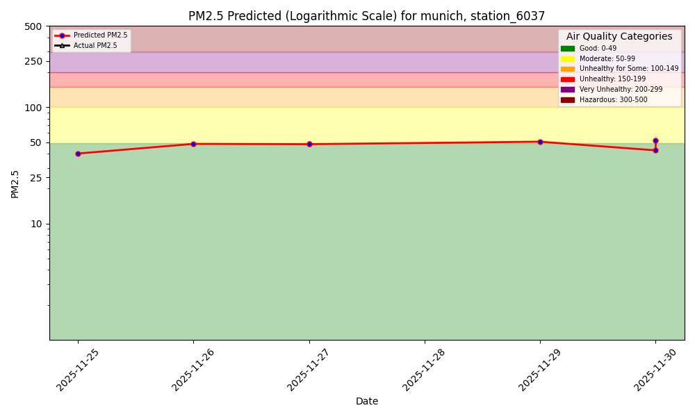
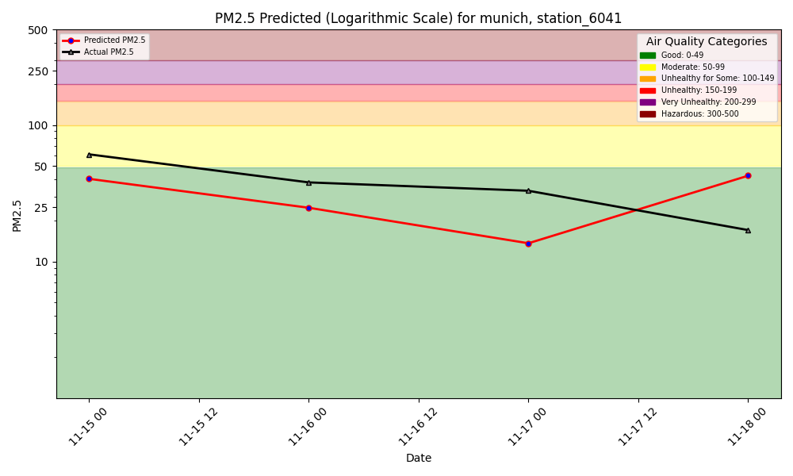
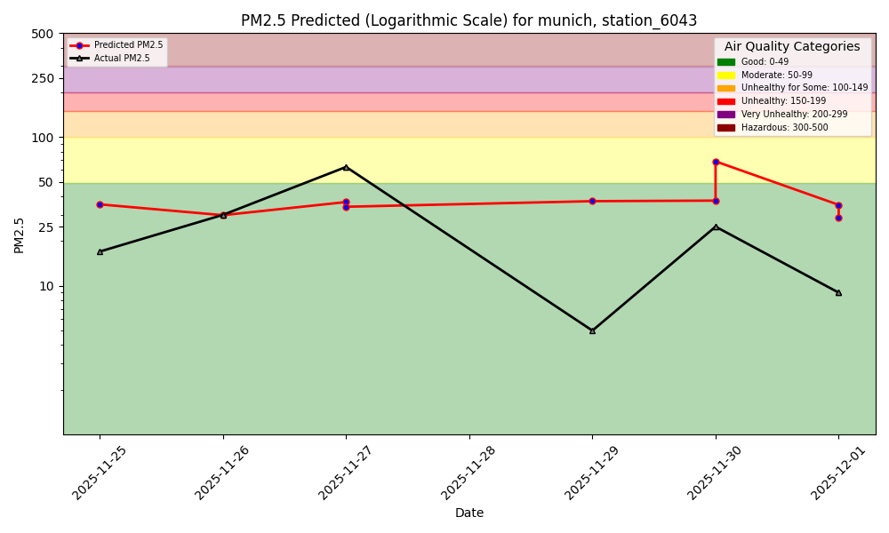
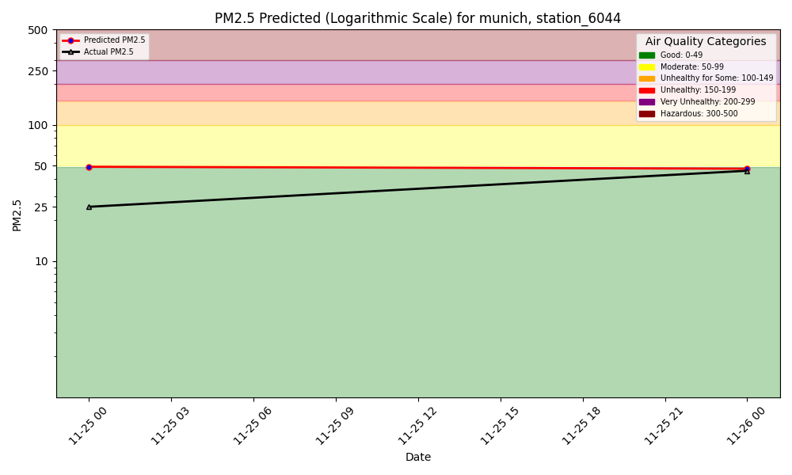

# Air Quality Dashboard



---

## Per-Sensor Forecasts

### Station 6037

### Station 6041

### Station 6042

### Station 6043

### Station 6044

---

# Model Performance Monitoring

1-Day Hindcast: Predictions vs Outcomes

---

## Per-Sensor 1-Day Hindcast

### Station 6037

### Station 6041

### Station 6042

### Station 6043

### Station 6044
